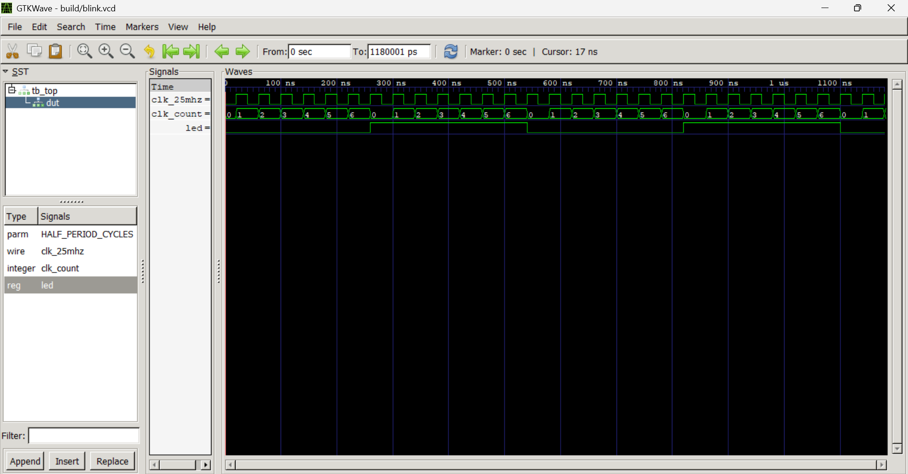

## Tool versions

| Tool | Version |
|------|---------|
| Icarus Verilog (`iverilog`, `vvp`) | 12.0 (devel) |
| Yosys | 0.69+62 (git sha1 0edda7a3a) |
| GTKWave | `gtkwave --version` | 1.0 |

Activate the suite in each new Bash terminal and check the tools:

```bash
source "$HOME/oss-cad-suite/environment"
iverilog -V
vvp -V
yosys -V
```

### Blink-count and counter-width calculation

Goal: a one-second full blink cycle at 25 MHz with equal on/off time.

- Full cycle = 1 s, so each half (on or off) = 0.5 s
- Clock cycles per half = 25,000,000 Hz x 0.5 s = **12,500,000**
- Default: `HALF_PERIOD_CYCLES = 12_500_000`
- The counter runs from 0 to 12,499,999, so it needs enough bits for 12,499,999
- 2^32 (the size of an int data type) = 4,294,967,296 is enough

Check with the simulation parameter: at 25 MHz one cycle is 40 ns, so a value of 7 gives 280 ns between flips and 560 ns for a full cycle.

## Simulation

`tb_top` has its own `HALF_PERIOD_CYCLES` parameter (default 7) that overrides the one on the `top` instance. It uses a 1 ns time unit, 1 ps precision, a 40 ns clock period, and writes `build/blink.vcd`.

It checks that:

- `led` starts low
- `led` is never X or Z
- `led` changes only at the expected times (first toggle at `20 + (N-1)*40` ns, then every `N*40` ns)
- `led` matches an expected value computed independently from the edge count, so the testbench does not reuse the design's own counter logic
- a separate timeout block fails the run if the LED never transitions

It uses `$fatal(1, ...)` on any failure, and prints `PASS` then calls `$finish` only after 30 clock cycles of checks.

### Commands

Default (7):

```bash
iverilog -g2012 -Wall -s tb_top -o build/tb_top rtl/top.sv sim/tb_top.sv
vvp build/tb_top
```

Override the parameter (6, then 1):

```bash
iverilog -g2012 -Wall -s tb_top -Ptb_top.HALF_PERIOD_CYCLES=6 \
     -o build/tb_top rtl/top.sv sim/tb_top.sv
vvp build/tb_top

iverilog -g2012 -Wall -s tb_top -Ptb_top.HALF_PERIOD_CYCLES=1 \
     -o build/tb_top rtl/top.sv sim/tb_top.sv
vvp build/tb_top
```

Each run replaces `build/blink.vcd`.

### Results

Run the default (7), 6, and 1 cases. Each run should print `PASS` and exit with status 0:

```bash
for n in 7 6 1; do
  echo "== HALF_PERIOD_CYCLES=$n =="
  iverilog -g2012 -Wall -s tb_top -Ptb_top.HALF_PERIOD_CYCLES=$n \
       -o build/tb_top rtl/top.sv sim/tb_top.sv && vvp build/tb_top
done
```

To check that the testbench catches a timing error, break the design by one cycle (compare against `HALF_PERIOD_CYCLES` instead of `HALF_PERIOD_CYCLES - 1`) and rerun. This should now fail with a `$fatal` message:

```bash
sed -i 's/HALF_PERIOD_CYCLES - 1/HALF_PERIOD_CYCLES/' rtl/top.sv
iverilog -g2012 -Wall -s tb_top -o build/tb_top rtl/top.sv sim/tb_top.sv && vvp build/tb_top
```

## Waveforms

```bash
iverilog -g2012 -Wall -s tb_top -o build/tb_top rtl/top.sv sim/tb_top.sv
vvp build/tb_top
gtkwave build/blink.vcd
```

Signals shown: `clk`, `clk_count` (unsigned decimal), `led`.



What the waveform shows (default 7):

- The clock period is 40 ns (first rise at 20 ns)
- `clk_count` counts 0 to 6 and wraps to 0 on the seventh rising edge (260 ns)
- `led` toggles on that same edge, so it toggles every 7 cycles = 280 ns
- A full LED cycle (high plus low) is 560 ns

## Synthesis

```bash
yosys -l build/synth.log -p 'read_verilog -sv rtl/top.sv; synth_ecp5 -top top -json build/top.json; check -assert; stat'
```

Synthesis used the real default (`HALF_PERIOD_CYCLES = 12500000`).

### Results (`build/synth.log`)

- `CHECK`: 0 problems
- No latches inferred
- One warning: use of the experimental `write_xaiger2` feature in the ABC9 step (from Yosys itself, not the design)
- Cell statistics:

| Cell | Count |
|------|-------|
| `TRELLIS_FF` | 33 |
| `LUT4` | 16 |
| `CCU2C` | 16 |
| `PFUMX` | 4 |
| `L6MUX21` | 1 |

The 33 flip-flops are the 32-bit `int` counter plus the `led` register. A 24-bit counter would need fewer.

Synthesis does not verify routed timing.

### Cells explained

- `TRELLIS_FF` stores one bit. In `build/top.json`, `led_TRELLIS_FF_Q` is the LED register: `CLK` is `clk_25mhz`, `Q` is the `led` net, `DI` comes from a `LUT4` that inverts `led`, and `CE` is driven by the "counter reached the end" logic, so it only updates on a toggle.
- `CCU2C` handles carry arithmetic and does the counting. Each one covers two counter bits. In the JSON, `clk_count_TRELLIS_FF_Q_1_DI_CCU2C_S1` has the current count bits on `B0` and `B1`, a carry chain via `CIN`/`COUT`, and `D0`/`D1` tied high. Its `S0`/`S1` outputs are the incremented bits, wired back to the `DI` inputs of the counter flip-flops.

## Reproduce everything

```bash
git clone https://github.com/YOUR-USERNAME/uwrl-ecp5-fpga-onboarding.git
cd uwrl-ecp5-fpga-onboarding
mkdir -p build
source "$HOME/oss-cad-suite/environment"

iverilog -g2012 -Wall -s tb_top -o build/tb_top rtl/top.sv sim/tb_top.sv
vvp build/tb_top
yosys -l build/synth.log -p 'read_verilog -sv rtl/top.sv; synth_ecp5 -top top -json build/top.json; check -assert; stat'
```